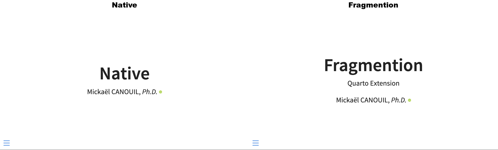

# Fragmention

A Quarto filter extension that hoists `.fragment` attributes from empty marker spans to their parent `<li>` elements in RevealJS presentations.
This makes list markers (bullets and numbers) appear and disappear together with the fragment content.

Also compatible with [`pandoc-ext/list-table`](https://github.com/pandoc-ext/list-table) for adding fragments to table cells and rows.



## Installation

```bash
quarto add mcanouil/quarto-revealjs-fragmention@0.2.0
```

This will install the extension under the `_extensions` subdirectory.
If you are using version control, you will want to check in this directory.

## Usage

Add the filter to your document's front matter:

```yaml
filters:
  - fragmention
```

Then place an empty `.fragment` span at the start of any list item:

```markdown
- []{.fragment fragment-index="1"} First item.
  - []{.fragment fragment-index="2"} Nested item.
  - []{.fragment fragment-index="3"} Another nested item.
- A normal item without a fragment.
```

The filter removes the empty span and applies its classes and attributes to the `<li>` element.
RevealJS then controls the entire list item's visibility, including the bullet marker.

### Fragment styles

All RevealJS fragment classes are supported:

```markdown
- []{.fragment .fade-in fragment-index="1"} Fade in.
- []{.fragment .highlight-red fragment-index="2"} Highlight red.
- []{.fragment .grow fragment-index="3"} Grow.
```

### Ordered lists

Works with ordered lists too:

```markdown
1. []{.fragment fragment-index="1"} First step.
2. []{.fragment fragment-index="2"} Second step.
3. []{.fragment fragment-index="3"} Third step.
```

### Definition lists

Place an empty `.fragment` span at the start of a definition to reveal the whole definition (and its term) as one fragment.
This is handy for glossary and question-and-answer slides.

```markdown
Spectroscopy
: []{.fragment fragment-index="1"} A technique to analyse chemical composition.

Chromatography
: []{.fragment fragment-index="2"} A technique to separate mixtures.
```

The filter removes the empty span and applies its classes and attributes to the `<dd>` element.

### Blockquotes

Place a leading empty `.fragment` span in a blockquote to reveal the whole quote as one fragment.

```markdown
> []{.fragment fragment-index="1"} The whole quote reveals together.
```

The filter removes the empty span and applies its classes and attributes to the `<blockquote>` element.

### list-table compatibility

When used with [`pandoc-ext/list-table`](https://github.com/pandoc-ext/list-table), ensure `list-table` runs first:

```yaml
filters:
  - list-table
  - fragmention
```

The `list-table` extension already consumes empty spans at the start of cells/rows and transfers their attributes.
Fragmention then renames `fragment-index` to `data-fragment-index` on table elements so RevealJS can recognise them.

```markdown
:::{.list-table}

- - []{.fragment fragment-index="1"} Name
  - []{.fragment fragment-index="1"} Value

- - []{.fragment fragment-index="2"} Another
    - []{.fragment fragment-index="2"} Data
      :::
```

### Auto-numbering

Set `fragmention.auto-number: true` in document metadata to assign sequential `fragment-index` values to every list item.
This makes every bullet a fragment without explicit markers, useful for slides that reveal a list one item at a time.

```yaml
fragmention:
  auto-number: true
```

Items that already carry a `fragment-index` are left untouched.
Nested lists are numbered depth-first, so a parent bullet reveals before its children.

### Validation

Set `fragmention.validate: true` to enable a per-slide validation pass.
A warning is emitted when a slide contains duplicate `fragment-index` values, or when a slide mixes fragments with and without an explicit `fragment-index`.

```yaml
fragmention:
  validate: true
```

Validation only inspects fragments hoisted by this filter (lists, definitions, blockquotes).
It does not flag `.fragment` spans or divs that are already RevealJS native.

## Example

Here is the source code for a minimal example: [example.qmd](example.qmd).

Rendered output:

- [HTML](https://m.canouil.dev/quarto-fragmention/).
